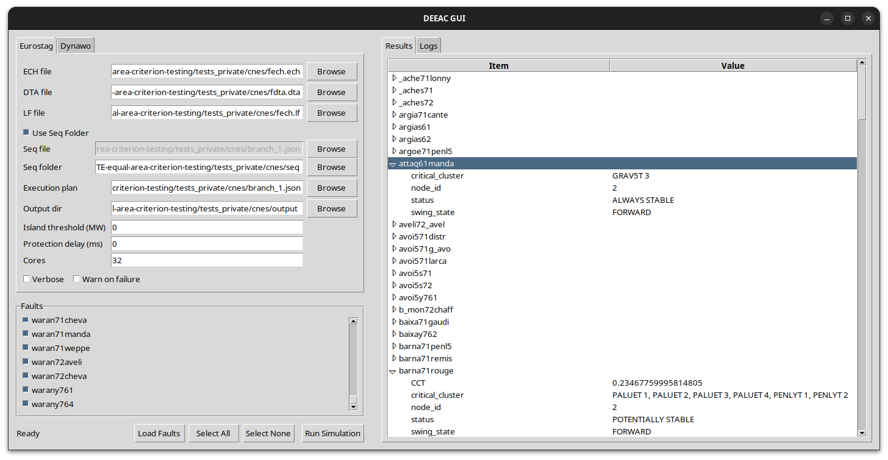
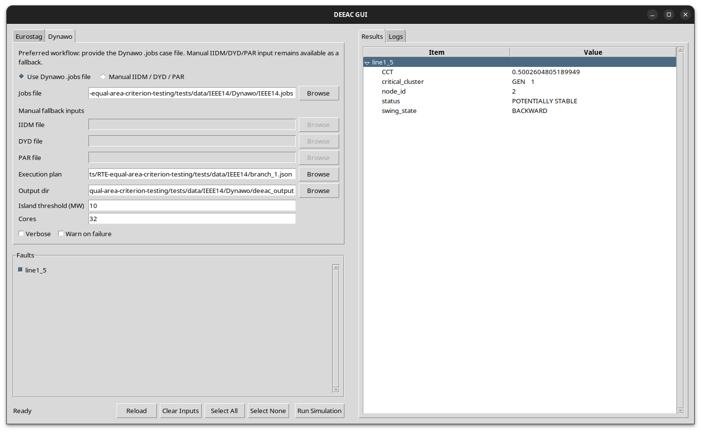

# DEEAC (RTE Equal Area Criterion)

DEEAC runs a fast transient stability analysis based on the Extended Equal Area Criterion (EEAC).
It reads Eurostag network data and fault events, identifies critical generator clusters, builds an
OMIB equivalent, and computes critical clearing times for each fault.

This repository expects **non-public data** (Eurostag cases). Do not publish sample data here.

## Requirements

- Python 3.10+
- Eurostag inputs:
  - `.ech` (topology)
  - `.dta` (dynamic generator data)
  - `.lf` (load-flow results)
  - `.seq` (fault events, one file or a folder)
- Dynawo inputs:
  - preferred: `.jobs` (Dynawo case entrypoint)
  - manual fallback: `.iidm` + `.dyd` + `.par`
- EEAC execution plan JSON (linear plan)

## Install

Editable install:

```bash
pip install -e .
```

If `tkinter` is missing, install the system Tk package before running the GUI.
This is especially common when using the system Python on Ubuntu.

Ubuntu / Debian, system Python:

```bash
sudo apt update
sudo apt install python3-tk
```

If you are using a version-specific Python outside the default Ubuntu `python3`,
install the matching Tk package if your distribution provides it, for example:

```bash
sudo apt install python3.12-tk
```

Quick check:

```bash
python3 -c "import tkinter; print(tkinter.TkVersion)"
```

If that import fails, the GUI will not start. The command line and programmatic
APIs do not require `tkinter` unless you actually launch the GUI.

Build a wheel:

```bash
python -m build
```

## Quick start

Run with a global configuration JSON:

```bash
deeac -g /path/to/config.json
```

## Eurostag inputs

For a Eurostag run, DEEAC expects four kinds of inputs:

- `fech.ech`: network topology and static electrical data.
- `fdta.dta`: dynamic generator and control-model data.
- `fech.lf`: load-flow results used to initialize the network state.
- one or more `.seq` files: fault and clearing events to evaluate.

In practice, one Eurostag case is usually a folder containing one common
`*.ech`, one common `*.dta`, one common `*.lf`, and many `*.seq` files. DEEAC
loads the common network once, then runs the EEAC pipeline independently for
each sequence file.

Programmatic usage should usually provide the fault files explicitly through
`EurostagRunConfiguration.seq_files`. The older `seq-file` and
`seq-file-folder` ideas exist mostly for CLI and GUI convenience.

## Configuration (global JSON)

Example:

```json
{
  "ech-file": "fech.ech",
  "dta-file": "fdta.dta",
  "lf-file": "fech.lf",
  "seq-file": "B-C_fault.seq",
  "execution-plan-file": "branch_1.json",
  "output-dir": "eeac_output",
  "cores": 1,
  "island-threshold": 0.0,
  "protection-delay": 0.0,
  "rewrite": false,
  "verbose": false,
  "warn": false
}
```

Notes:
- Use exactly one of `seq-file` or `seq-file-folder` (legacy key `seq-files-folder` is accepted).
- Use exactly one of `execution-plan-file` or an inline plan (`branch` or `execution-plan`).
- Paths are resolved relative to the JSON file location.
- `output-dir` writes a default JSON output file; alternatively use `json-results`.

Dynawo example:

```json
{
  "dynawo-jobs-file": "network.jobs",
  "execution-plan-file": "branch_1.json",
  "output-dir": "eeac_output",
  "cores": 1,
  "island-threshold": 0.0,
  "protection-delay": 0.0,
  "rewrite": false,
  "verbose": false,
  "warn": false
}
```

Notes:
- Preferred Dynawo configuration uses `dynawo-jobs-file` or `jobs-file`.
- Manual fallback is still supported through `iidm-file`, `dynawo-dyd-file`, and `dynawo-par-file`.
- Dynawo fault events are discovered from the Dynawo dynamic files rather than from Eurostag-style `.seq` files.

## CLI options (summary)

- `-e`, `--ech-file` Path to `.ech`.
- `-d`, `--dta-file` Path to `.dta`.
- `-l`, `--lf-file` Path to `.lf`.
- `-s`, `--seq-file` Path to a single `.seq`.
- `-f`, `--seq-file-folder` Path to a folder of `.seq` files.
- `-t`, `--execution-tree-file` Path to the execution plan JSON.
- `-o`, `--output-dir` Output folder for results.
- `-j`, `--json-results` Output JSON path (exclusive with `-o`).
- `-c`, `--cores` Parallel workers.
- `-i`, `--island-threshold` Islanding threshold in MW.
- `-p`, `--protection-delay` Protection delay in ms.
- `-r`, `--rewrite` Overwrite output directory.
- `-v`, `--verbose` Verbose mode.
- `-w`, `--warn` Treat failed candidates as a global warning.
- `-g`, `--global-configuration` Global JSON config.

## Outputs

Results are returned to the caller and optionally written to JSON. Each fault produces a result
with fields like:

- `status`
- `CCT`
- `critical_cluster`
- `swing_state`
- `node_id`
- `warning` / `error_msg`

## Programmatic use

```python
from deeac.main import deeac

results = deeac(["-g", "/path/to/config.json"])
print(results.to_dict())
```

Dynawo parsing (optional):

```python
from deeac.IO.dynawo.parse_dynawo import parse_dynawo

network = parse_dynawo(
    jobs_file="/path/to/network.jobs",
    iidm_file=None,
    dynawo_dyd_file=None,
    dynawo_par_file=None,
)
```

Using `deeac_eurostag` with an explicit configuration object:

```python
from deeac.main import deeac_eurostag
from deeac.IO.arguments_parser import EurostagRunConfiguration

config = EurostagRunConfiguration(
    ech_file="/path/to/fech.ech",
    dta_file="/path/to/fdta.dta",
    lf_file="/path/to/fech.lf",
    execution_tree_file="/path/to/branch_1.json",
    execution_tree=None,
    seq_file=None,
    seq_file_folder="/path/to/case",
    seq_files=[
        "/path/to/case/B-C_fault.seq",
        "/path/to/case/A-B_fault.seq",
    ],
    island_threshold=0.0,
    cores=1,
    protection_delay=0.0,
    verbose=False,
    output_dir=None,
    json_path=None,
    rewrite=False,
    warn=False,
)

results = deeac_eurostag(config)
print(results.to_dict())
```

This is the recommended direct-Python form: give the common Eurostag files once
and provide the fault cases explicitly in `seq_files`. Use `seq_file` only for
the one-fault convenience case.

If you prefer, you can build `EurostagRunConfiguration` via `parse([...])` and pass it to `deeac_eurostag`.

Using `deeac_dynawo` with an explicit configuration object:

```python
from deeac.main import deeac_dynawo
from deeac.IO.arguments_parser import DynawoRunConfiguration

config = DynawoRunConfiguration(
    jobs_file="/path/to/network.jobs",
    iidm_file=None,
    dynawo_dyd_file=None,
    dynawo_par_file=None,
    dynawo_dyn_file=None,
    execution_tree_file="/path/to/branch_1.json",
    execution_tree=None,
    island_threshold=0.0,
    cores=1,
    protection_delay=0.0,
    verbose=False,
    output_dir=None,
    json_path=None,
    rewrite=False,
    warn=False,
)

results = deeac_dynawo(config)
print(results.to_dict())
```

This is the recommended Dynawo form: pass the case `.jobs` file and let the
parser resolve the IIDM and dynamic files. Manual mode is still available when
you need to provide `iidm_file`, `dynawo_dyd_file`, and `dynawo_par_file`
explicitly.

Both `deeac_eurostag` and `deeac_dynawo` delegate to `deeac_run(config)`, which
accepts either `EurostagRunConfiguration` or `DynawoRunConfiguration`.

For the explicit step-by-step flow, see `deeac/deeac_single_path.py` and
`trunk/quick_run_simple.py`.

## Graphical User Interface

The GUI allows you to run an Eurostag-based configuration or a Dynawo-based
configuration. The left side is used to load the case and choose the faults.
The right side is used to inspect the EEAC results and the structured logs.

The GUI mode can be run by executing the `main.py` file passing no arguments.

### Eurostag workflow



Use the Eurostag tab when you have one common Eurostag network and one or more
`.seq` files describing the disturbances to evaluate.

- `ECH file`
  Path to the Eurostag topology file. This defines the buses, branches,
  breakers, shunts, loads, and static generators of the network.
- `DTA file`
  Path to the Eurostag dynamic-data file. This gives the synchronous generator
  dynamic parameters needed by the EEAC computations.
- `LF file`
  Path to the Eurostag load-flow result file. This initializes the pre-fault
  operating point used as the starting state of the simulation.
- `Use Seq Folder`
  Enable this when the case contains many `.seq` files in one folder. This is
  the normal way to load a complete Eurostag case.
- `Seq file`
  Path to a single `.seq` file. Use this when you want to run only one fault.
- `Seq folder`
  Path to a folder containing many `.seq` files. Each `.seq` file becomes one
  fault entry in the fault list.
- `Execution plan`
  Path to the EEAC execution-plan JSON. This is the deterministic list of EEAC
  steps that will be run for every selected fault.
- `Output dir`
  Optional output directory. If it is filled, DEEAC writes per-fault output
  files there. If it is left empty, you can still inspect the results inside
  the GUI.
- `Island threshold (MW)`
  Threshold used to decide whether a post-fault island is large enough to keep
  during the network reduction steps.
- `Protection delay (ms)`
  Maximum allowed spread between the first and last protection-clearing action
  inside one `.seq` file. If the spread is larger than this value, the case is
  marked as degraded protection.
- `Cores`
  Number of worker processes used to run the selected faults in parallel.
- `Verbose`
  Enables detailed log messages in the `Logs` tab.
- `Warn on failure`
  Keeps a result with warnings when some candidate clusters fail. If disabled,
  those faults are more likely to be reported as full failures.

Typical Eurostag operator flow:

- Fill `ECH file`, `DTA file`, and `LF file`.
- Choose either one `Seq file` or a `Seq folder`.
- Fill `Execution plan`.
- Optionally fill `Output dir`.
- Click `Reload` to parse the network and populate the fault list.
- Select the faults you want to evaluate.
- Click `Run Simulation`.


### Dynawo workflow

The Dynawo workflow tab is the Dynawo equivalent of the Eurostag tab. It also
follows the same broad logic: load a configuration, parse it into a `Network`,
discover the available faults, and then run EEAC on the selected ones.




- `Use Dynawo .jobs file`
  Preferred mode. Use this for a normal Dynawo case. The `.jobs` file is the
  case entrypoint and points to the IIDM network, the DYD model file, the PAR
  parameter file, and the solver configuration.
- `Manual IIDM / DYD / PAR`
  Fallback mode. Use this only when you want to provide the main Dynawo files
  explicitly instead of relying on the `.jobs` file.
- `Dynawo .jobs file`
  Path to the `.jobs` case file. In preferred mode this is normally the only
  Dynawo input file you need to choose manually.
- `IIDM file`
  Manual-mode field. Path to the PowSybl IIDM network file.
- `DYD file`
  Manual-mode field. Path to the Dynawo dynamic-architecture file. DEEAC reads
  generator dynamic-model references and supported event models from this file.
- `PAR file`
  Manual-mode field. Path to the Dynawo parameter file that contains the
  numerical parameter values used by the DYD models.
- `Execution plan`
  Path to the EEAC execution-plan JSON, exactly as in the Eurostag workflow.
- `Output dir`
  Optional output directory for the generated per-fault files.
- `Island threshold (MW)`
  Threshold used to decide whether a post-fault island is large enough to keep.
- `Cores`
  Number of worker processes used to run the selected faults in parallel.
- `Verbose`
  Enables detailed log messages in the `Logs` tab.
- `Warn on failure`
  Keeps a result with warnings when some candidate clusters fail.

Typical Dynawo operator flow:

- Keep `Use Dynawo .jobs file` selected.
- Fill `Dynawo .jobs file`.
- Fill `Execution plan`.
- Optionally fill `Output dir`.
- Click `Reload` to parse the Dynawo case and populate the discovered fault list.
- Select the faults you want to evaluate.
- Click `Run Simulation`.

### Results tree

The `Results` tab shows one top-level row per executed fault. Expand a fault row
to inspect the individual result fields returned by the EEAC run.

- `Item`
  Name of the field.
- `Value`
  Value computed for that field.

The most important result fields are usually:

- `status`
  Overall EEAC outcome for the fault, for example stable, potentially stable,
  unstable, degraded protection, or computation failure.
- `CCT`
  Critical clearing time in seconds. This is usually the main quantity users
  compare between candidate faults.
- `critical_cluster`
  Generator cluster selected as critical for the final accepted result.
- `swing_state`
  OMIB swing direction used by the final accepted result.
- `node_id`
  Identifier of the last execution-plan node that produced the result.
- `warning`
  Non-fatal issues, such as failed candidate clusters when warning mode is
  enabled.
- `error_msg`
  Error description when the fault could not be evaluated normally.

The `Logs` tab contains the structured execution log grouped by fault. This is
the place to inspect when a result has warnings, when `CCT` is `None`, or when
you need to understand where the execution plan stopped.


## More docs

- [understanding_the_code.md](docs/understanding_the_code.md) explains the architecture and data flow.
- [paper.md](docs/paper.md) summarizes the EEAC paper used as the reference.
